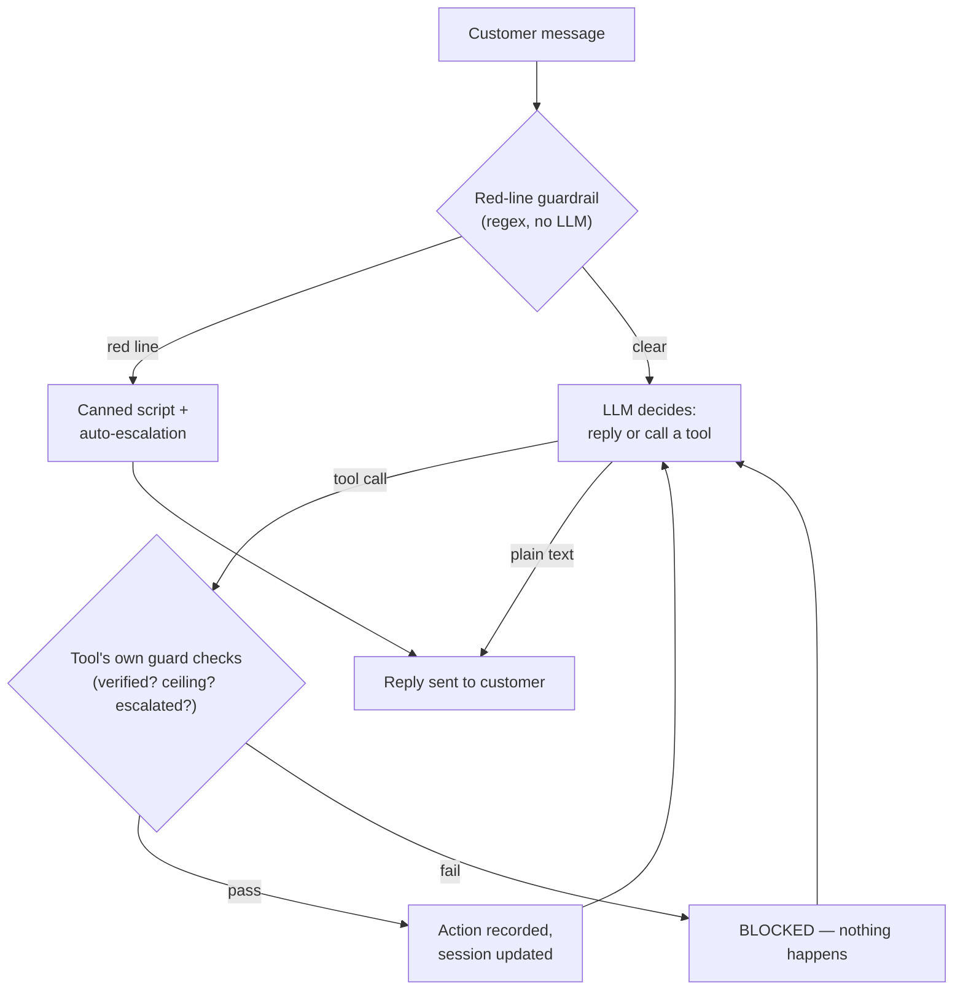

# Frondly Leaf Support — write-up

## Design

A small [LangGraph](https://github.com/langchain-ai/langgraph) graph runs a local, free LLM (Llama 3.2
via Ollama) that reads the conversation plus a condensed policy summary, and decides what to say and
which of four tools to call — looping until it replies in plain text. The model is never trusted alone
with anything the guide says must never fail: a regex guardrail catches red lines (legal, safety, press,
third-party, prompt injection) *before* the model sees the message, and every tool independently
re-checks verification, the $50 refund ceiling, and prior escalations before acting, regardless of what
the model argues for. Session state (verified?, refund total, escalated categories, chat history) lives
in a plain dict owned by the caller and persists for the conversation. This split — LLM for
understanding and tone, code for guarantees — came from testing: prompt reminders alone weren't
reliable, since the local model sometimes ignored "already escalated, don't act" on a later turn (see
`AI_USE.md`). LangGraph earns its place here because there's a genuinely non-deterministic step in the
loop (the model), unlike a pure rule-engine.

## How a message flows

## Why a local model, not a paid API

LangGraph implies a real LLM making decisions, not a rule engine in disguise. Cost was a real concern
for a one-time demo, so Llama 3.2 via Ollama runs the whole thing free, offline, no API key. Trade-off:
a small local model is less reliable at following instructions than something like Claude, which is
exactly why the hard-coded guardrails exist. Swapping in a stronger model later wouldn't require
changing the graph or tool contract.

## Eval results

`solution/eval.py` runs all 18 conversations twice, checking **policy** (verification, refund ceiling,
red-line escalation, no third-party actions) and **helpfulness** (did it answer the real question)
separately, plus **stability** across runs.

- **106/108 checks passed (98.2%)** — policy 84/86 (97.7%), helpful 22/22 (100%)
- **Stability: 18/18** conversations identical on both actions *and* reply text across runs
- **Known gap:** a refund claim made outside the 14-day return window got auto-refunded instead of
  escalated (conv-13) — the only unresolved failure, both runs

## What I'd harden next

- Make the 14-day COA window auditable: require the model to state `days_since_delivery` explicitly as
  a tool argument instead of trusting its own date arithmetic
- Cross-check reply text against the tool log before sending — occasionally the reply claims success on
  an action that was actually `BLOCKED`
- Grow the red-line keyword list against a held-out set (it's regex-based, so it can miss unseen phrasing)
- Swap in a stronger hosted model to compare against this free baseline before using it beyond a demo

## AI-tool disclosure

Built end-to-end with Claude Code (Claude Sonnet 5) per direct request to rebuild yesterday's
non-LangGraph solution using LangGraph and a free local model. See `AI_USE.md` for the full disclosure,
including specific bugs found by reading transcripts and the fixes each one led to.
